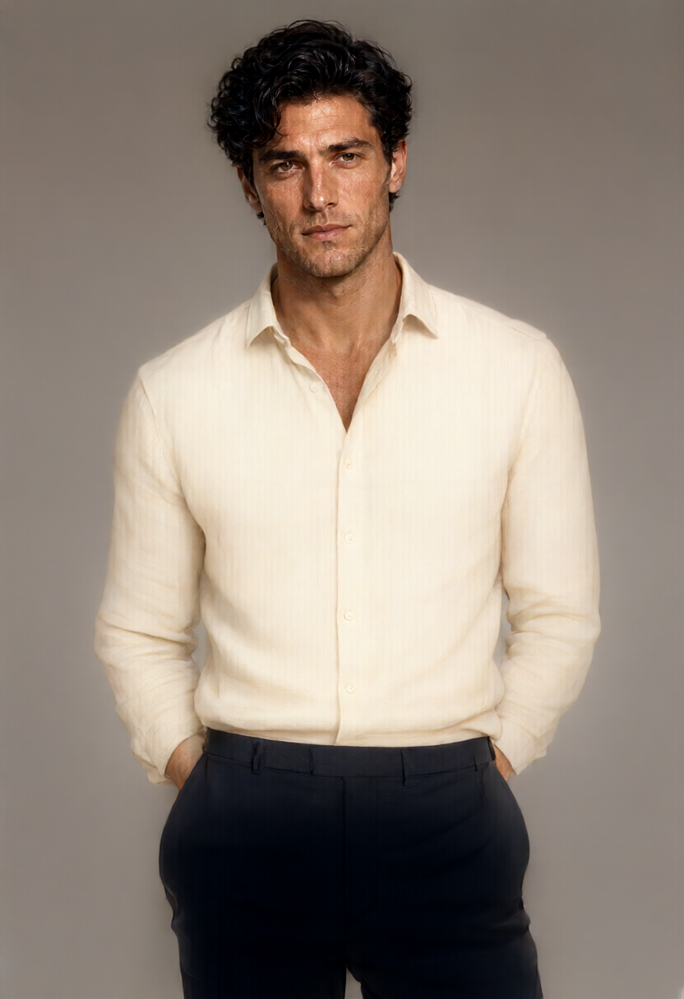

# Qwen Image Local

Generate images on a Windows NVIDIA PC with **Qwen-Image-2.1 Q4**, directly from your coding agent or terminal. No hosted image API is used during generation.

[Landing page](https://cskwork.github.io/qwen-image-local/) · [Agent skill](skills/qwen-image-local/SKILL.md)



## What is tested

Windows, RTX 4060 **8GB**, 32GB RAM. The shown 832×1216 portrait took **134.2 seconds**, including runtime loading and saving, at 20 Euler steps, CFG 6, seed 42. One measured run is not a speed guarantee. The original BF16 run was interrupted, so no matched before/after benchmark is claimed. Other GPUs and operating systems are not validated.

## Install the skill

Requires Git and Python 3.11+. In PowerShell:

```powershell
git clone https://github.com/cskwork/qwen-image-local.git
cd qwen-image-local
$skillRoot = Join-Path $HOME '.codex\skills'
New-Item -ItemType Directory -Path $skillRoot -Force | Out-Null
if (Test-Path (Join-Path $skillRoot 'qwen-image-local')) { throw 'Skill already exists; review it before replacing.' }
Copy-Item -Recurse skills\qwen-image-local $skillRoot
```

Start a new agent chat if needed, then ask:

> Use $qwen-image-local to create a studio portrait on my local PC.

> $qwen-image-local 로 내 PC에서 자연스러운 인물 사진을 만들어줘.

Other agents that support `SKILL.md` can use the same skill folder in their documented skill directory.

## Install the model once

Windows x64, NVIDIA CUDA-compatible driver, `curl.exe`, and around **16GB free disk space** are required. The measured system had 8GB VRAM and 32GB RAM. The installer downloads about 11GB from pinned upstream revisions and verifies SHA-256. Model weights are not included in this repository.

```powershell
python skills/qwen-image-local/scripts/qwen_local.py install
python skills/qwen-image-local/scripts/qwen_local.py doctor --verify
```

Default model storage: `%LOCALAPPDATA%\qwen-image-local`. For an existing installation, pass `--root` **before** the command:

```powershell
python skills/qwen-image-local/scripts/qwen_local.py --root 'D:\models\qwen-image-local' doctor
```

You can also set `QWEN_IMAGE_LOCAL_ROOT` or put `{"root":"D:\\models\\qwen-image-local"}` in the installed skill's `local.json`. Local configuration is ignored by Git. See [setup and recovery](skills/qwen-image-local/references/setup.md).

## Generate

```powershell
python skills/qwen-image-local/scripts/qwen_local.py generate --prompt 'A natural studio portrait of an adult model in a cream linen shirt, gray background, soft light' --output outputs/portrait.png
```

Defaults: **832×1216**, **20 steps**, seed **42**. Options: `--width`, `--height`, `--steps`, `--seed`, `--max-vram`. Dimensions must be multiples of 32 from 256 to 2048; higher resolutions are not benchmarked. Outputs must be PNG. Existing images, logs, and metadata files are never overwritten. Tiled VAE decoding is enabled for the tested 8GB GPU.

The helper saves the PNG, a diagnostic `.png.log`, and generation settings/timing in `.png.json`. It checks the exit status, output existence, PNG header, and dimensions; the agent then visually inspects the image. Errors remain errors. No automatic model deletion, background server, network call during generation, or hosted fallback.

**Text-to-image only.** Image editing needs extra vision weights and a separately tested workflow.

## Models and licenses

| Component | Upstream | File size |
|---|---|---:|
| Image model, Q4_K_M | [Unsloth Qwen-Image-2.1-GGUF](https://huggingface.co/unsloth/Qwen-Image-2.1-GGUF) | 4.20GB |
| Text encoder, UD-Q4_K_XL | [Unsloth Qwen3-VL-8B-Instruct-GGUF](https://huggingface.co/unsloth/Qwen3-VL-8B-Instruct-GGUF) | 5.15GB |
| Model-specific BF16 VAE | [Unsloth Qwen-Image-2.1-FP8](https://huggingface.co/unsloth/Qwen-Image-2.1-FP8) | 0.68GB |
| Windows CUDA12 runtime | [stable-diffusion.cpp 3f8527a](https://github.com/leejet/stable-diffusion.cpp/releases/tag/master-929-3f8527a) | 0.90GB download |

Sizes are download sizes, not total VRAM requirements. Upstream models and runtime retain their own licenses, including the Qwen Research license shown by the image-model publisher. Check those terms for your intended use; this repository does not relicense the weights. This is an independent integration, not an official Qwen or Unsloth product.

Repository code and documentation: [MIT](LICENSE). The sample is an AI-generated fictional adult portrait produced with the documented local model; it is not a real-person endorsement. Its PNG retains generation parameters.

## Development

```powershell
python -m unittest discover -s tests -v
python -m http.server 8765 --directory docs
```

Tests cover failure reporting, output preservation, literal prompt arguments, model verification, and archive path protection. CI does not download model weights or claim GPU inference coverage. Actual local inference is verified separately before publication.
